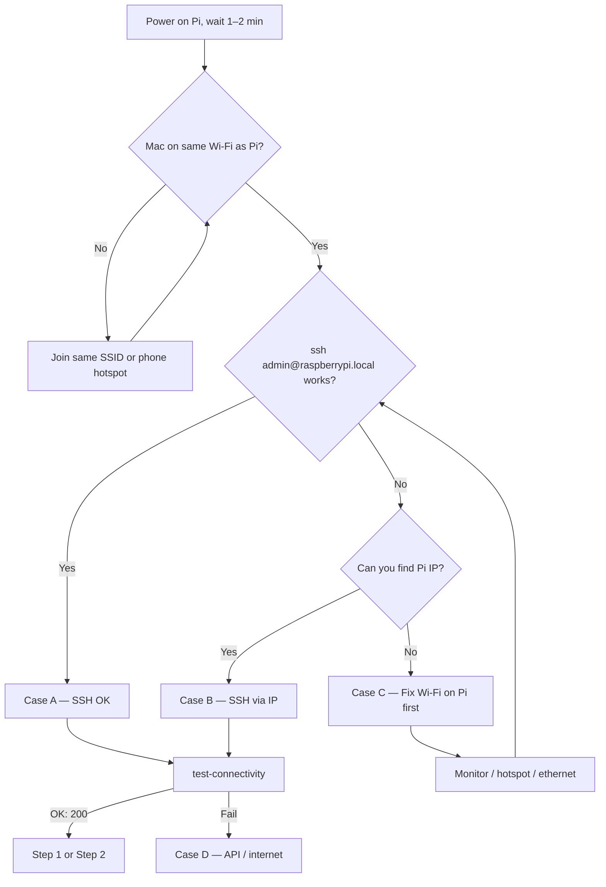

# Raspberry Pi — Wi‑Fi, Room & Area Changes (All Cases)

One Pi moved between buildings, classrooms, or Wi‑Fi networks.  
This guide covers **every way to get back in** and **what to run after SSH works**.

---

## Two networks (do not confuse them)

| Network | Role | Changes when you move? |
|---------|------|-------------------------|
| **Local Wi‑Fi (wlan)** | Mac ↔ Pi (SSH, `sync-to-pi.sh`) | **Yes** — new SSID, new IP, mDNS may fail |
| **Internet → VPS API** | Pi ↔ attendance API | **No** — same URL from any Wi‑Fi with internet |

| Resource | Value |
|----------|--------|
| Dashboard | https://pfe-attendance-system-dashboard.vercel.app |
| API (production) | `http://187.77.171.204:4000/api` |
| Default SSH user | `admin` |
| Default hostname | `raspberrypi.local` |
| Project on Pi | `~/raspberry-pi` |
| Python venv | `source gate-env/bin/activate` |

**Keep `~/raspberry-pi/.env` as-is** when changing rooms (do not point `API_BASE_URL` at your Mac).

### Dashboard face photos (Vercel → VPS)

Enrollment step 5 uploads images to the **VPS API** (`187.77.171.204`). The API then calls `FACE_EMBED_SERVICE_URL` to compute face embeddings.

| `FACE_EMBED_SERVICE_URL` on VPS | Works from dashboard? |
|--------------------------------|------------------------|
| `http://192.168.x.x:5055/embed` (Pi LAN IP only) | **No** — VPS cannot reach your Pi’s private IP → `fetch failed` |
| `http://187.77.171.204:5055/embed` (embed server on VPS) | **Yes** |
| Public/tunnel URL to Pi `:5055` | **Yes**, if the tunnel is up |

**Fix:** On the VPS, set `FACE_EMBED_SERVICE_URL` to an embed service the VPS can reach, then restart the API:

1. **Recommended (Option A):** Full steps in **[docs/VPS-FACE-EMBED.md](VPS-FACE-EMBED.md)** — clone repo on VPS, `./setup-vps-embed.sh`, systemd, `FACE_EMBED_SERVICE_URL=http://127.0.0.1:5055/embed`.
2. **Alternative:** Keep embed on the Pi (`./start-enrollment.sh`), expose port `5055` with a tunnel (ngrok, Cloudflare Tunnel, etc.), and set `FACE_EMBED_SERVICE_URL` to that public URL on the VPS.

Pi enrollment mode (`./start-enrollment.sh`) only helps **RFID auto-fill** on step 1; the dashboard still needs a **VPS-reachable** embed URL for step 5.

---

## Decision flow



---

## Case A — Pi joins known Wi‑Fi, SSH by hostname

**When:** This SSID was saved on the Pi before; Mac and Pi are on the **same** network.

```bash
ssh admin@raspberrypi.local
cd ~/raspberry-pi && source gate-env/bin/activate
python3 gate_attendance.py --test-connectivity
```

| Check | Pass |
|-------|------|
| SSH | Login prompt, no timeout |
| API | `OK: 200` |

**Then:**

| Mode | Command |
|------|---------|
| Enrollment (admin desk) | `./start-enrollment.sh` |
| Gate (classroom) | `./start-gate.sh` |

---

## Case B — Pi is online, but `raspberrypi.local` fails

**When:** mDNS blocked, wrong subnet, or hostname changed — Pi **has** Wi‑Fi but you need its IP.

### B1 — Find IP from Mac (same Wi‑Fi)

```bash
ping -c 2 raspberrypi.local
arp -a
```

Check the **router admin page** → connected devices → `raspberrypi` or new DHCP lease.

### B2 — SSH by IP

```bash
ssh admin@192.168.x.x
```

### B3 — Sync code from Mac (optional)

Does **not** overwrite Pi `.env`.

```bash
cd /path/to/pfe-attendance-system/raspberry-pi
./sync-to-pi.sh 192.168.x.x
./sync-to-pi.sh --with-models 192.168.x.x   # includes FaceNet models (large)
```

Environment overrides:

```bash
PI_USER=admin PI_HOST=192.168.x.x ./sync-to-pi.sh
```

### B4 — Verify API (same as Case A)

```bash
cd ~/raspberry-pi && source gate-env/bin/activate
python3 gate_attendance.py --test-connectivity
```

---

## Case C — Pi does not join the new Wi‑Fi

**When:** Only the old SSID was configured; Pi has **no** LAN → SSH from Mac **impossible** until Wi‑Fi is fixed **on the device**.

| Recovery | Steps |
|----------|--------|
| **C1 — Monitor + keyboard** | HDMI + USB keyboard → desktop Wi‑Fi icon → join network, or `sudo raspi-config` → System Options → Wireless LAN |
| **C2 — Pre-add networks** | While SSH still works at old site: save every SSID you will use (classrooms, lab, office) |
| **C3 — Phone hotspot** | Once: add hotspot name/password on Pi. At new site: enable hotspot → Mac + Pi on it → `ssh admin@raspberrypi.local` |
| **C4 — Ethernet** | Plug Pi into router → find IP in router client list → `ssh admin@<IP>` |
| **C5 — Re-flash SD** | Last resort; restore image and re-run `setup-gate-env.sh` + `.env` |

**There is no repo command to fix Wi‑Fi remotely if the Pi is offline.**

After C1–C4, continue with **Case A** or **Case B**.

---

## Case D — SSH works, API test fails

**When:** `python3 gate_attendance.py --test-connectivity` does **not** show `OK: 200`.

| Symptom | Likely cause | Fix |
|---------|--------------|-----|
| Connection refused / unreachable | Wrong `API_BASE_URL` or VPS down | Confirm `API_BASE_URL=http://187.77.171.204:4000/api` in `~/raspberry-pi/.env`; test VPS from Mac: `curl http://187.77.171.204:4000/api/health` |
| Timeout | Pi has no internet on Wi‑Fi | Router captive portal, wrong DNS, or firewall — fix wlan first |
| 401 / 403 | Device secret mismatch | Match `ENROLLMENT_DEVICE_SECRET` / `VERIFICATION_DEVICE_SECRET` with VPS (do not regenerate unless VPS updated) |
| DNS error | No outbound internet | Ping `8.8.8.8` from Pi; fix Wi‑Fi or router |

```bash
cd ~/raspberry-pi && source gate-env/bin/activate
python3 gate_attendance.py --test-connectivity
python3 admin_enrollment.py --test-connectivity   # enrollment desk
```

---

## Case E — SSH works, project missing or outdated

**When:** Fresh SD, empty home, or code never synced.

**On Pi (first time):**

```bash
cd ~/raspberry-pi
./setup-gate-env.sh
source gate-env/bin/activate
```

**On Mac:**

```bash
cd /path/to/pfe-attendance-system/raspberry-pi
./sync-to-pi.sh raspberrypi.local
# or ./sync-to-pi.sh <PI_IP>
```

Copy `.env` on Pi manually if needed (sync does **not** overwrite `.env`). Use `raspberry-pi/.env.example` as template; set secrets to match VPS.

---

## Case F — Hardware checks after reconnect (optional)

Run before a demo in the new room:

```bash
cd ~/raspberry-pi && source gate-env/bin/activate

python3 admin_enrollment.py --test-rfid
python3 gate_attendance.py --test-feedback
python3 gate_attendance.py --test-lcd
python3 gate_attendance.py --test-connectivity
```

| Test | Pass |
|------|------|
| RFID | `version 0x91` and card detected |
| Feedback | Green + beep, then red blinks |
| LCD | Messages cycle |
| API | `OK: 200` |

---

## What never changes when you move

- `API_BASE_URL` → VPS URL (not Mac `localhost`)
- `DEVICE_ID`, `GATE_DEVICE_ID`, device secrets (unless you register new devices on VPS)
- Dashboard URL
- Enrollment / gate start scripts

---

## What you might change (rare)

| Situation | Change |
|-----------|--------|
| New physical Pi | New `DEVICE_ID` / secrets on VPS + `.env` |
| SPI / RFID wiring differs | `SPI_BUS`, `SPI_DEVICE` in `.env` |
| Different camera | `CAMERA_INDEX` |

---

## Prevent problems before the next move

1. **Save all Wi‑Fi networks** you will use (including phone hotspot).
2. **Note the Pi IP** from the router while SSH works.
3. Run **`--test-connectivity`** once on the new Wi‑Fi before a session.
4. Keep **`.env` backed up** (without committing secrets to git).

---

## Quick reference

| Task | Command |
|------|---------|
| SSH (hostname) | `ssh admin@raspberrypi.local` |
| SSH (IP) | `ssh admin@192.168.x.x` |
| Activate env | `cd ~/raspberry-pi && source gate-env/bin/activate` |
| Test API (gate) | `python3 gate_attendance.py --test-connectivity` |
| Test API (enrollment) | `python3 admin_enrollment.py --test-connectivity` |
| Test RFID | `python3 admin_enrollment.py --test-rfid` |
| Start enrollment | `./start-enrollment.sh` |
| Start gate | `./start-gate.sh` |
| Gate tests | `./start-gate.sh --test-connectivity` (and `--test-feedback`, `--test-lcd`) |
| Sync from Mac | `./sync-to-pi.sh [host-or-ip]` |
| First-time env | `./setup-gate-env.sh` |

---

## Case summary table

| Case | Situation | Action |
|------|-----------|--------|
| **A** | Known Wi‑Fi, mDNS OK | `ssh admin@raspberrypi.local` → test API → start mode |
| **B** | Online, no hostname | Find IP → `ssh admin@<IP>` → optional `sync-to-pi.sh` |
| **C** | Pi not on Wi‑Fi | Fix Wi‑Fi on Pi (monitor / hotspot / ethernet) → A or B |
| **D** | SSH OK, API fail | Fix `.env`, internet, VPS, secrets |
| **E** | No/outdated code | `setup-gate-env.sh` + `sync-to-pi.sh` + `.env` |
| **F** | Pre-demo validation | Full hardware + API test commands |

---

## Related files in repo

- [`raspberry-pi/.env.example`](../raspberry-pi/.env.example) — template for Pi environment
- [`raspberry-pi/sync-to-pi.sh`](../raspberry-pi/sync-to-pi.sh) — deploy code from Mac
- [`raspberry-pi/setup-gate-env.sh`](../raspberry-pi/setup-gate-env.sh) — Python venv on Pi
- [`raspberry-pi/start-enrollment.sh`](../raspberry-pi/start-enrollment.sh) / [`start-gate.sh`](../raspberry-pi/start-gate.sh) — run modes
